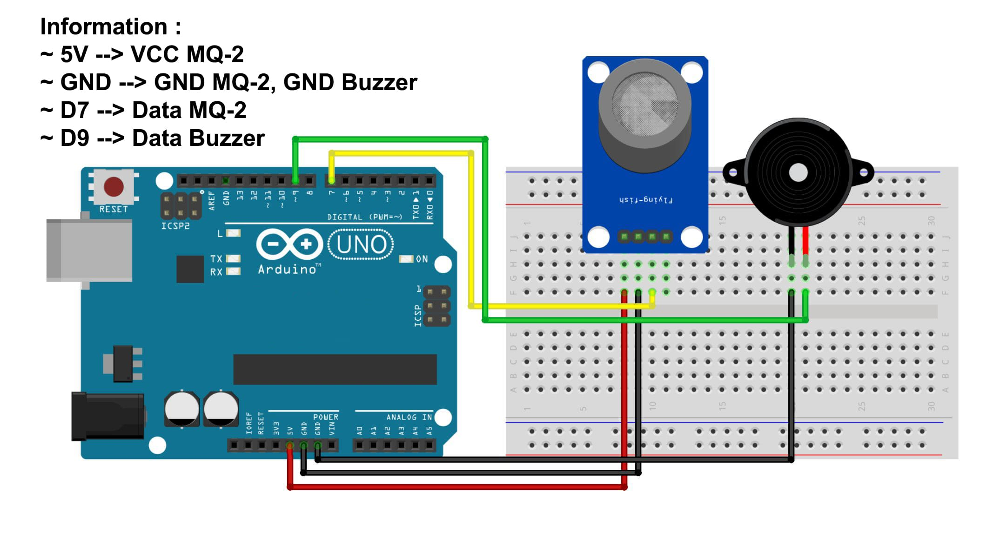

# Gas Leak Detector with Arduino (Leak Detection Alarm in Gas Cylinders)

This project implements a simple gas leak detection system using an Arduino. The system continuously monitors for gas leaks using a gas sensor. If a leak is detected, a buzzer is activated to alert users.

## Description

The code reads the state of a gas sensor connected to an Arduino. When the sensor detects a gas leak (indicated by a LOW signal), the system triggers an alarm by turning on a buzzer in a series of five pulses. If no gas leak is detected, the system waits for 1 second before rechecking the sensor.

## Components Required

- Arduino IDE or VS Code;
- Library MQ-2 Sensor;
- Arduino board (e.g., Uno, Mega)
- Gas sensor (connected to digital pin 7)
- Buzzer (connected to digital pin 8)
- Jumper wires
- Breadboard (optional)

# Schematic:

- Below you can see a schematic image to facilitate the wiring of cables from the microcontroller to devices, both input and output sensors:

## Wiring

- **Gas Sensor**: Connect the sensor's output to digital pin 7 on the Arduino.
- **Buzzer**: Connect the positive terminal to digital pin 8 on the Arduino and the negative terminal to GND.

## How It Works

1. **Sensor Reading**: The gas sensor output is read via digital pin 7.
2. **Leak Detection**: If the sensor reads LOW, it indicates a gas leak.
3. **Alarm Activation**: Upon detecting a leak, the buzzer is turned on and off five times, each for 500 milliseconds, creating an audible alarm.
4. **Looping**: The system checks the sensor state every second when no leak is detected.

## Code Breakdown

- **Pin Configuration**:

  - `Buzzer`: Digital pin 8
  - `Gas Sensor`: Digital pin 7

- **Functions**:
  - `setup()`: Initializes the sensor and buzzer pins.
  - `loop()`: Continuously monitors the gas sensor and triggers the alarm if a leak is detected.
  - `alarm()`: Handles the buzzer activation for the alarm.

## Usage

1. Upload the code to the Arduino.
2. Power the Arduino and observe the buzzer when the gas sensor detects a leak.
3. The system will automatically reset and continue monitoring after each alarm cycle.

## Notes

- Ensure the gas sensor is calibrated according to its datasheet before use.
- The delay between sensor checks can be adjusted by modifying the `delay(1000)` line in the code.

## Conclusion:

- The program works by detecting air conditions surrounding. If a gas leak is detected then The buzzer will sound to notify you gas leak.

